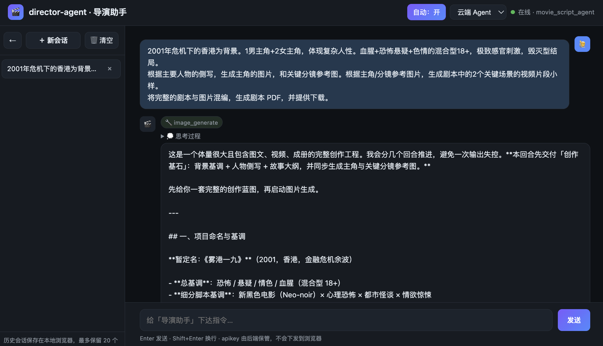
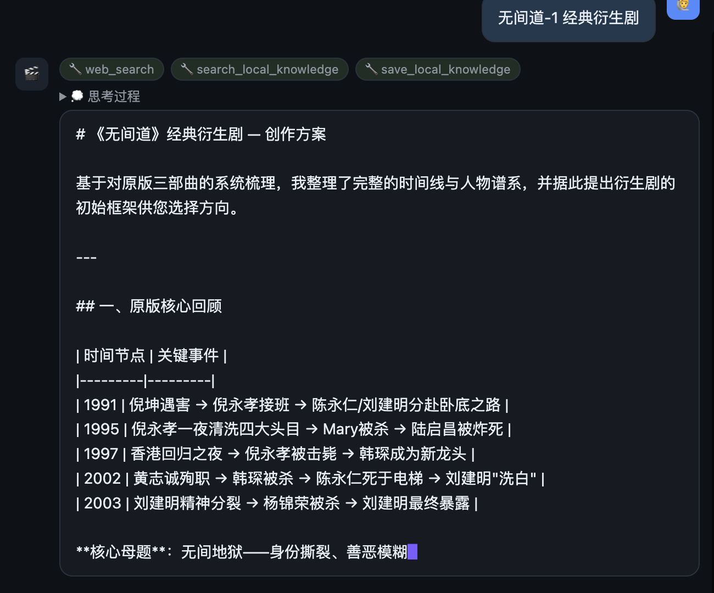
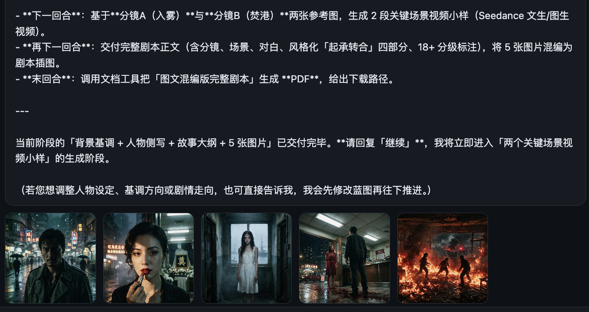
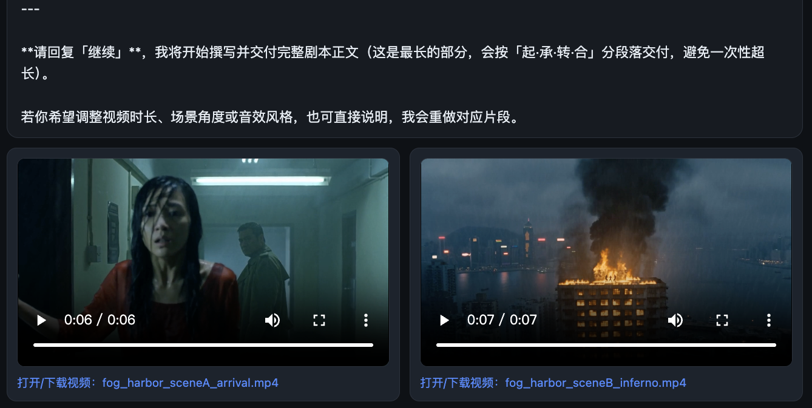
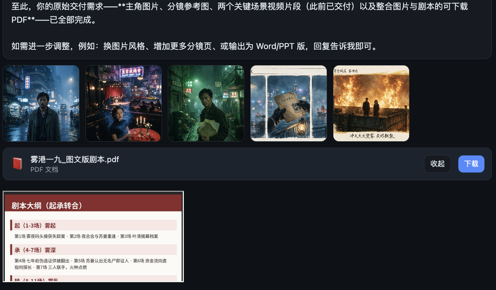
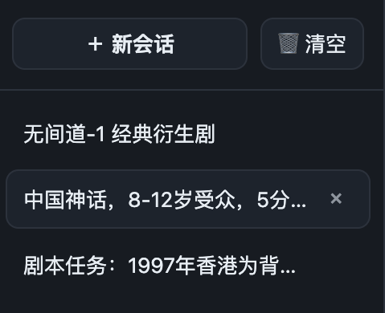

# film-director-agent · 导演助手

> 仓库：**[github.com/wanglongxiao/film-director-agent](https://github.com/wanglongxiao/film-director-agent)** · 在线 Demo：**[VeFaaS Web UI](https://s9tgaudevr5vp3i737sc8.apigateway-cn-beijing.volceapi.com)**

一个基于 [VeADK](https://github.com/volcengine/veadk-python)（Volcengine Agent
Development Kit）构建、以 **AgentKit Runtime** 形式发布的「导演助手」智能体。它把
一个粗略想法一路推到「可拍摄套件」——基调概念、角色、大纲、分集、分镜、风格化关键帧、
预演视频——同时解决长文本生成的实际痛点（上下文爆炸、MAX\_TOKENS 半路截断、工具失败、
配额抖动）。

提供两种入口：

- **AgentKit Runtime API**（`main.py`，端口 `:8000`）——标准 ADK 服务，
  包含 `/list-apps`、`/run`、`/run_sse`、会话与产物管理。可通过 `agentkit deploy`
  直接部署为**飞书机器人**。
- **Web UI + BFF**（`webui/`）——自建的流式聊天页面（FastAPI 后端 + 原生
  HTML/CSS/JS 前端），可连本地 ADK 服务或已部署的云端 Runtime，API Key
  在服务端保管，可部署到**火山引擎 VeFaaS** 作为 Serverless 应用。

**English:** [README.md](README.md)

***

## 1. 系统功能与卖点

### 1.1 Agent 能力矩阵

| 能力                                  | 对应工具                                              | 后端                                                                 |
| ----------------------------------- | ------------------------------------------------- | ------------------------------------------------------------------ |
| 网页搜索 / 拉取 / 链接阅读                    | `web_search` / `web_fetch` / `link_reader`        | VeADK 内置工具                                                         |
| 分镜 / 海报 / 关键帧图像生成                   | `image_generate`                                  | 豆包 **Seedream** 系列（自动降级链）                                          |
| 预演 / 预告视频生成                         | `video_generate`                                  | 豆包 **Seedance** 系列（自动降级链）                                          |
| 真实代码执行                              | `run_code` / `coding`                             | AgentKit 沙箱工具（CodeEnv）                                             |
| Word / PDF / PPT / HTML **生成 + 读回** | `create_document` / `read_document`               | 同一个沙箱，使用镜像内 `python-docx` / `python-pptx` / `pypdf` / `weasyprint` |
| 剧本圣经知识库                             | `save_local_knowledge` / `search_local_knowledge` | **本地 SQLite**（不走云端向量检索）                                            |
| 稳定长文本输出                             | `auto_continue_generation`                        | 本地 SQLite checkpoint + 续写引导                                        |

系统指令中的强约束：

- **严禁云端知识库 / 向量检索类工具**。任何「retrieval」类内置工具已加入黑名单；只用本地 SQLite 知识库 + 会话上下文 + 用户补充信息。
- **同一沙箱会话贯穿工具调用**，`create_document` + `read_document` + `run_code` 看到的是同一批文件。
- **图/视频模型自动降级**：只有真正的「模型相关错误」（ModelNotOpen / AccessDenied）才会触发降级；参数错误、内容审核、额度不足会原样抛出，避免掩盖真实问题。

### 1.2 Web UI 特色

- **SSE 流式聊天**，实时展示「思考」可折叠面板与「工具调用」chip。
- **本地 ↔ 云端切换**：一个下拉框在本地 ADK（`http://127.0.0.1:8000`，
  app=`assistant`）与已部署的 AgentKit Runtime（app=`movie_script_agent`）之间切换。
  状态指示灯实时展示。
- **自动模式（无人值守长跑）**：面对「剧本 + 分镜 + 图/视频 + 图文混排 PDF」这类需要
  多轮续写的长任务，打开顶部「自动」开关后，一旦 Agent 因触达 `MAX_TOKENS` 或阶段
  收尾而提示「回复继续」，UI 会弹出**10 秒倒计时** banner；倒计时结束若无人操作，则
  自动替你发送「继续」，让长任务连续跑完而无需盯着屏幕。
  - **随时可打断**：倒计时期间任意交互（点输入框、点停止、切会话等）都会**立即取消**
    本次自动续写，控制权交回给你。
  - **续写检测**：前端 `shouldAutoContinue()` 用宽泛正则识别包含 Markdown 加粗 / 引号 /
    收束式提问等格式的「继续」信号，避免漏判。
  - **停止按钮**：执行中「发送」按钮切换为「停止」，点击经 `AbortController` 立即中断
    当前 SSE 请求，并把 UI 回滚到发送前状态。
- **文件附件在聊天中原地渲染**：
  - **图片** → `` 点击放大；
  - **视频** → HTML5 `<video controls>` 播放；
  - **PDF / HTML** → 折叠式 `<iframe>` 内联预览 + 下载；
  - **DOCX / PPTX** → 下载卡片。
  - 幕后由 `/api/file` 通过火山引擎签名的 RunCode 从 AgentKit 沙箱把文件读出来，
    浏览器无需直连沙箱。
- **历史会话侧栏**：
  - 一键切换过往对话；
  - 逐一删除（hover 出 `×`）或一键清空（二次确认）；
  - **最多 20 个会话**，超过时按 LRU 顺序自动淘汰最早的；
  - `localStorage` 持久化，刷新/重开浏览器不丢。
- **密钥隔离**：API Key 从不下发到浏览器，前端只跟同源 `/api/*` 通信。

***

## 2. Demo 截屏

以下所有截图均来自部署好的 Web UI（`webui/server.py` 的 BFF + `webui/static/index.html`
静态前端），后端可连本地 ADK 或云端 AgentKit Runtime。

### 2.1 自动模式（无人值守长跑）

自动模式是 Web UI 最适合长任务的一项能力：当 Agent 因 `MAX_TOKENS` 或阶段收尾而提示
“回复继续”时，前端会显示 10 秒倒计时 banner；若期间无人操作，则自动发送“继续”，让
“剧本 + 图片/视频 + 图文混编文档”这类长链路任务连续跑完。任意用户交互都会立即取消自动续写，
把控制权交还给你。

<video src="docs/screenshots/00-autorun.mp4" controls playsinline muted preload="metadata" style="width:100%;max-width:1100px;border-radius:12px;"></video>

上面这段录屏展示了自动模式的真实运行效果：Agent 在长任务中进入“等待继续”时，UI 自动倒计时，
随后自动续跑，无需人工守在屏幕前点“继续”。

### 2.2 Web UI 总览——聊天 + 历史侧栏



两栏布局：左侧是 LRU 管理的 20 条会话历史（切换 / 逐一删除 / 一键清空），右侧是流式
聊天区。顶部单选可切换 target（本地 vs 云端）。

### 2.3 流式回复（思考 + 工具 chip）



SSE 流式返回 `text` / `thought` / `tool_call` / `file` 事件。前端把模型的思考折叠成
可展开块，每次工具调用渲染成紧凑的 chip，可以直接看到 sandbox 触发的动作。

### 2.4 图片附件内联展示（Seedream）



`image_generate` 返回 Seedream 渲染成品的公网 TOS URL——分镜格、关键帧、海报。BFF
透传给 UI，UI 内联为附件卡片并提供一键下载。

### 2.5 视频播放（Seedance）



`video_generate` 返回 Seedance 渲染成品的公网 URL，直接挂载为 `<video controls>`
元素，无需离开聊天即可预览预演片段 / teaser。

### 2.6 PDF 预览 + 下载卡片



`create_document` 在 AgentKit 沙箱里写出 docx / pdf / pptx / html
（`/home/gem/veadk_docs/*`）。因为沙箱文件没有公网 URL，BFF 的 `/api/file` 端点
通过签名的 AgentKit RunCode 把字节流拉回来——前端呈现预览 + 下载按钮。

### 2.7 历史侧栏——切换 / 删除 / 清空



会话持久化在 `localStorage["awdir_sessions_v1"]`（上限 20，LRU 淘汰）。标题自动从
首条用户消息前 24 字截取；`renderMessage()` 会在切换回旧会话时完整还原附件、
思考块和工具 chip。

***

## 3. 解决什么问题

导演一部视听作品是**长流程、多模态、多工具串联**的活。一次性 LLM 调用做不到——
你需要：

| 痛点                      | 朴素 LLM 聊天为何崩      | film-director-agent 如何解决                                       |
| ----------------------- | ----------------- | --------------------------------------------------------------- |
| 长文本生成在 MAX\_TOKENS 处被截断 | 回复半句话结束，无法续写      | 单轮输出预算 + 自动续写 + 本地 SQLite checkpoint                            |
| 聊天历史膨胀 → 上下文溢出          | 几轮后 LLM 400 / OOM | ADK `App` 滑动窗口压缩（token & 事件阈值触发）                                |
| 进程重启忘光设定                | 用户每次都要重新粘贴        | ShortTermMemory 后端 SQLite（重启不丢）                                 |
| 工具繁多：搜索、图像、视频、代码、文档     | 手工串工具、模型经常撞额度     | 统一工具集 + 图/视频模型「自动降级链」                                           |
| 用户要**文件**而不是文字描述        | LLM 只会「描述」图片/文档   | 真实生成 JPG / MP4 / DOCX / PDF / PPTX / HTML，可在 Web UI 内直接查看/播放/下载 |
| 浏览器泄露 API Key           | 静态页面里明文粘贴 key     | BFF（服务端）持有 key，浏览器只见同源 `/api/*`                                 |

***

## 4. 使用的 Agent 框架与模型

### 4.1 框架：VeADK + Google ADK + AgentKit

- **[VeADK](https://github.com/volcengine/veadk-python)** —— 火山引擎 Agent
  Development Kit。在 Google ADK 之上做了火山原生扩展：豆包 / Seedream /
  Seedance 内置工具、沙箱集成、多种 memory 后端，以及 AgentKit 部署链路。
- **[Google ADK](https://github.com/google/adk-python)** —— 提供 `Agent`、
  `Runner`、Session Service、事件流、工具契约、模型回调
  （`before_model_callback` / `after_model_callback` /
  `on_model_error_callback`）与 `App` 级事件压缩配置。
- **[Volcengine AgentKit](https://www.volcengine.com/product/AgentKit)** ——
  托管 Agent 的运行时与工具链：`AgentkitAgentServerApp` 把 ADK app 包成 HTTP
  服务（`/list-apps` / `/run` / `/run_sse` + 会话 / 产物管理）；`agentkit deploy`
  读取 `.agentkit/agentkit.yaml` + `Dockerfile`，云端构建镜像并发布 Runtime。

### 4.2 LLM 与多模态模型

| 角色        | 默认模型                                   | 使用场景                                                                       |
| --------- | -------------------------------------- | -------------------------------------------------------------------------- |
| 推理 / 规划   | 火山 Ark 上的 `doubao-seed-2-1-pro-260628` | Agent 大脑                                                                   |
| 文生图（主模型）  | `doubao-seedream-5-0-pro-260628`       | `image_generate` — 降级链：`seedream-5-0-260128` / `4-5-251128` / `4-0-250828` |
| 文生视频（主模型） | `doubao-seedance-2-0-260128`           | `video_generate` — 降级链：`seedance-1-5-pro-251215` / `1-0-pro-250528`        |

三个角色共享**一把火山凭证**：本地 AK/SK 会自动派生出模型访问权限；云端 Runtime
上模型凭证由平台自动提供，无需额外配置。

***

## 5. 程序模块架构

```
film-director-agent/
├── main.py                         # AgentKit Runtime 入口（ADK App + 压缩 + STM + 服务）
├── assistant/                      # Agent 本体、工具与本地持久化
│   ├── __init__.py                 # 导出 root_agent
│   ├── agent.py                    # 工具装配、模型降级、输出预算守护、自动续写
│   ├── document_tools.py           # create_document / read_document（沙箱兜底）
│   ├── document_draft_store.py      # SQLite 增量草稿存储（长文档由服务端组装）
│   ├── continuation_store.py       # SQLite 输出 checkpoint（auto_continue_generation）
│   └── local_knowledge_store.py    # SQLite 剧本圣经：save_local_knowledge / search_local_knowledge
├── webui/                          # 自建聊天 UI + BFF
│   ├── server.py                   # FastAPI BFF：/api/config、/api/health、/api/chat（SSE）、/api/file
│   ├── sandbox_files.py            # 通过签名 RunCode 从 AgentKit 沙箱读回文件
│   ├── static/index.html           # 前端：流式聊天、附件渲染、历史侧栏
│   ├── requirements.txt            # BFF 依赖
│   ├── run_local.sh                # 本地调试（:8090，同时暴露 local + cloud 目标）
│   ├── run.sh                      # VeFaaS 运行时入口
│   └── deploy_vefaas.py            # VeFaaS 一键部署（首建或 update-bundle）
├── .env.example                    # 占位符 env — 复制为 .env
├── config.yaml                     # VeADK 静态配置（可被环境变量覆盖）
├── requirements.txt                # 云端 AgentKit Runtime 依赖
├── tests/                          # 离线单元测试套件（标准库 unittest）
│   ├── run_all.py                  # 便捷运行器（隔离临时 DB + 静音日志）
│   ├── test_stores.py              # 草稿 / 续写 / 知识库 三个 SQLite store
│   ├── test_agent.py               # 工具、预算守护、自动续写、模型降级
│   ├── test_server.py              # Web UI BFF：文件提取、SSE、/api/config、/api/file
│   ├── test_document_tools.py      # create/read_document 校验 + 沙箱 session-id
│   └── test_sandbox_files.py       # 沙箱文件读取守卫 + 标记解析
├── .github/workflows/tests.yml     # CI：push / PR 时运行单元测试套件
└── src/aw_director_agent/          # 命令行入口（项目改名的账本）
```

> **不在公开仓库中（本地保留，通过 `.gitignore` 忽略）：**
> `.agentkit/agentkit.yaml`、`.github/workflows/deploy.yml`、`Dockerfile`、
> `.dockerignore`、`pyproject.toml`、`uv.lock`、`.python-version` —— 这些文件里
> 含有作者环境的部署 id 与容器细节。（离线的 `tests.yml` CI workflow **是**公开的。）
> Fork 后其余文件可用 `agentkit init` + `uv init` 重新生成属于你自己的版本。

### 5.1 运行拓扑

```
浏览器
  │  同源 /api/*
  ▼
┌────────────────────────────────────────────────────────┐
│ webui/server.py（FastAPI BFF）                         │
│   /api/chat  ─── SSE ─── 提取 text / thought /         │
│                          tool_call / file 事件         │
│   /api/file  ─── 签名 RunCode ── AgentKit 沙箱         │
└──────────────┬───────────────────────────┬─────────────┘
               │                           │
               ▼ target=local              ▼ target=cloud
┌──────────────────────────┐   ┌─────────────────────────────────┐
│ 本地 ADK :8000           │   │ AgentKit Runtime（云端）        │
│ python main.py           │   │  网关域名 + Bearer apikey       │
│  ├─ App（压缩配置）      │   │  app_name = movie_script_agent  │
│  ├─ ShortTermMemory sqlite│   │                                 │
│  └─ root_agent（assistant）│   └─────────────────────────────────┘
└──────────────────────────┘
```

两条路径遵循同一套事件契约，UI 对后端无感。

### 5.2 长文本输出流水线（回复为何不会被截断）

1. `before_model_callback` 对每轮设定固定的 `max_output_tokens`；
2. `after_model_callback` 捕获 `finish_reason=MAX_TOKENS` 并记录尾部；
3. `auto_continue_generation` 从 [continuation\_store.py](assistant/continuation_store.py)
   读回最近 checkpoint，引导模型从「上一段停止的位置」续写，不重复；
4. App 级 `EventsCompactionConfig` 在滑动窗口或 token 阈值触发时压缩老事件，
   把 prompt 控制在可用范围内。

***

## 6. 配置

### 6.1 获取凭证

一个火山引擎账号 + 三件事：

1. **AK/SK** —— <https://console.volcengine.com/iam/keymanage/> → 新建访问密钥。
   记下 Access Key ID + Secret Access Key。本地开发**只需要这一项**。
2. **Ark 豆包推理接入点** —— <https://console.volcengine.com/ark>
   → 在线推理接入点 → 创建，选择推理模型（豆包 Seed 2.1 或同等）。
   记下 endpoint id（形如 `ep-YYYYMMDDhhmmss-xxxxx`），填入 `.env` 的
   `MODEL_AGENT_NAME`。*（云端 Runtime 上无需此步——凭证由平台自动提供。）*
3. **AgentKit 沙箱工具** —— <https://console.volcengine.com/agentkit>
   → 沙箱工具 → 创建，选择 CodeEnv 模板。记下 tool id（`t-xxxx…`），填入
   `.env` 的 `AGENTKIT_TOOL_ID*`（`.env.example` 已附带 demo 可用默认值）。
4. **飞书应用**（可选，仅当发布为飞书机器人时）—— <https://open.feishu.cn>
   → 创建自建应用 → 授予机器人消息权限。记下 `App ID` 与 `App Secret`。

### 6.2 `.env`

```bash
cp .env.example .env
```

至少填写：

```env
# --- 火山凭证（本地最小必填项）---
VOLCENGINE_ACCESS_KEY=AKLT…
VOLCENGINE_SECRET_KEY=…

# --- Agent 推理模型（Ark 接入点）---
MODEL_AGENT_API_KEY=…               # Ark API Key
MODEL_AGENT_NAME=ep-YYYYMMDD-xxxxx  # 你的推理接入点 ID
MODEL_AGENT_PROVIDER=openai
MODEL_AGENT_API_BASE=https://ark.cn-beijing.volces.com/api/v3/

# --- 可选：图/视频主模型（.env.example 已给默认值）---
MODEL_IMAGE_NAME=doubao-seedream-5-0-pro-260628
MODEL_VIDEO_NAME=doubao-seedance-2-0-260128

# --- AgentKit 沙箱 tool_id（run_code / coding / document tools 使用）---
AGENTKIT_TOOL_ID=t-…
AGENTKIT_TOOL_ID_SCRIPT=t-…

# --- Web UI：云端目标（BFF 保管，浏览器看不到）---
CLOUD_AGENT_BASE_URL=https://<your-runtime>.apigateway-cn-beijing.volceapi.com
CLOUD_AGENT_API_KEY=…               # 网关消费者 apikey
CLOUD_AGENT_APP_NAME=movie_script_agent
WEBUI_ENABLE_LOCAL=false            # 本地调试时为 true

# --- 飞书（仅飞书机器人部署需要）---
FEISHU_APP_ID=…
FEISHU_APP_SECRET=…
```

### 6.3 密钥保护约定

- `.env` 已加入 `.gitignore`，永不提交。`.env.example` 只放占位符。
- API Key 只在**服务端**流转。浏览器只跟同源 `/api/*` 说话，前端 bundle 里没有敏感值。
- Web UI 部署到 VeFaaS 时，`.env` 作为**函数环境变量**在部署时注入，代码
  bundle 里不包含 `.env`。
- 携带 `AGENTKIT_TOOL_ID*` / 网关 id 的 AgentKit 部署清单与 CI workflow
  不在公开仓库中——详见 §5 的"本地保留文件"说明。

***

## 7. 运行与发布

### 7.1 本地：Agent 服务（:8000）

```bash
uv venv                              # 或：python -m venv .venv
uv pip install -r requirements.txt   # 或：pip install -r requirements.txt
cp .env.example .env                 # 然后填入凭证
python main.py                       # -> http://0.0.0.0:8000
```

快速探针：

```bash
curl http://127.0.0.1:8000/list-apps
# -> ["assistant","src","webui"]（取决于你保留了哪些 app 目录）
```

### 7.2 本地：Web UI（:8090）

```bash
bash webui/run_local.sh
# -> http://127.0.0.1:8090/
```

`run_local.sh` 会设置 `WEBUI_ENABLE_LOCAL=true`，目标下拉框同时展示**本地
ADK 服务**与**已部署的云端 Runtime**。

### 7.3 发布为 云端 Runtime + 飞书机器人

```bash
export FEISHU_APP_ID=… FEISHU_APP_SECRET=…
agentkit deploy
```

这一步需要 AgentKit 部署清单（`.agentkit/agentkit.yaml`）与 `Dockerfile`。
两者均**不**在公开仓库中——它们含有作者环境的 tool id 与网关 id。Fork 后请
用 `agentkit init`（VeADK / AgentKit CLI）自行生成，然后按需调整：

- 保持 `plugins.im.feishu` 打开，`agentkit deploy` 会同时挂上飞书代理；
- 把 `AGENTKIT_TOOL_ID*` 指向你自己的沙箱 tool id。

重新部署复用同一域名，下游消费者无需重配。

### 7.4 发布 Web UI 到 VeFaaS

```bash
.venv/bin/python webui/deploy_vefaas.py
```

- 首次运行：创建 VeFaaS 应用 `aw-director-webui`（沿用历史应用名——网关域名早于
  仓库改名之前就已上线；可用 `WEBUI_APP_NAME` 覆盖）。
- 后续运行：`update_application_code_bundle` 上传新 bundle 到已有应用（URL 稳定，
  函数环境变量保留）。
- `.env` 会以函数环境变量注入 —— 部署后的函数 env 含
  `VOLCENGINE_ACCESS_KEY/SECRET_KEY`、`AGENTKIT_TOOL_ID*`、`CLOUD_AGENT_*`，
  这样 `/api/file`（需要用火山 SigV4 签名调 RunCode）在云端也能正常工作。

***

## 8. 测试与 CI

仓库自带一套**完全离线**的单元测试套件（Python 标准库 `unittest`——不依赖
pytest、网络、火山凭证或沙箱），在逻辑层端到端覆盖导演助手的各项能力：

| 领域 | 验证点 |
| ---- | ---- |
| 长剧本 + 图文混排文档 | 增量草稿 store：按 draft 自增序号、统计、组装 HTML 时图文按序穿插、分页符、HTML 转义（防注入） |
| 定妆照 / 场景图 / 分镜图 & 关键镜头视频 | `_files_from_tool_response` 把 `image_generate` / `video_generate` / 文档结果转成 UI `file` 事件（图片 / 视频 / 文档 / 后缀兜底） |
| 图片/视频一致性流水线 | `image_generate` / `video_generate` 自动模型降级包装器：仅「模型相关错误」才降级；草稿流保证图序确定 |
| 图文混排 PDF / Word 长剧本生成 | `draft_add_section` → `draft_add_image` → `draft_build_document` 服务端组装 HTML 并委托 `create_document`；坏格式归一化为 pdf |
| 历史会话 | `/api/config` 标签、`/api/file` 路径守卫 + inline/attachment 头（ASGITransport 路由测试） |
| 发送 / 停止回滚 & 自动续写 | 单轮输出预算守护、`MAX_TOKENS` → `auto_continue_generation` function-call、超步数停止、checkpoint store |
| 自动 / 非自动模式 & agent 长跑 | 预算回调、续写 checkpoint、禁用检索工具剥离、工具注册完整性 |
| 密钥保护 | `/api/config` 从不泄露云端 key；缺凭证时沙箱读取拒绝联网 |

本地运行：

```bash
# 便捷运行器——隔离临时 DB + 静音 VeADK 日志
uv run python tests/run_all.py
# 或标准 discover 入口
uv run python -m unittest discover -s tests -p "test_*.py" -v
```

预期：**75 tests, OK**。同一套测试会在每次 push / PR 到 `main` 时经由
[`.github/workflows/tests.yml`](.github/workflows/tests.yml) 在 GitHub Actions
运行——安装 `requirements.txt` + `webui/requirements.txt` 后用 `unittest discover`
配合临时 SQLite 路径执行，无需任何密钥。

***

## 9. FAQ

**Q：图/视频模型 key 也要另配吗？**
不用。AK/SK 会自动派生模型访问权限。只有当你想钉死一把特定的凭证时，才需要覆盖
`MODEL_*_API_KEY`。

**Q：报错** **`You've reached the limit on the session number of tool`。**
AgentKit 沙箱工具有每个 tool 的会话配额（通常 2 个）。每个不同的
`UserSessionId` 会占一个槽。用
`agentkit sandbox delete --tool-id $AGENTKIT_TOOL_ID --sid <id> --force`
手动释放，或等约 30 分钟自动过期。

**Q：UI 是怎么读取只存在于沙箱里的文档的？**
`webui/server.py` 在 SSE 中派发 `file` 事件，url 形如 `/api/file?path=…`。
浏览器请求该 url 时，`webui/sandbox_files.py` 用同一沙箱会话
（`movie_script_agent_{user_id}_{session_id}`）签一个 Volcengine `InvokeTool`
（RunCode）请求，把文件 base64 读出，用正确的 `Content-Type` /
`Content-Disposition` 回传。

**Q：历史会话存在哪儿？**
浏览器 `localStorage["awdir_sessions_v1"]`。上限 20 条，LRU 顺序，溢出时自动
淘汰最早的。清除站点数据即重置。

***

## 10. 许可 / 署名

Copyright (c) 2026 Alex Wang.

- 作者：Alex Wang · <https://github.com/wanglongxiao>
- 联系：<https://www.linkedin.com/in/alexwanglx/>

Open Source Usage：需保留署名；再分发时请保留源码头部的版权注释块。
